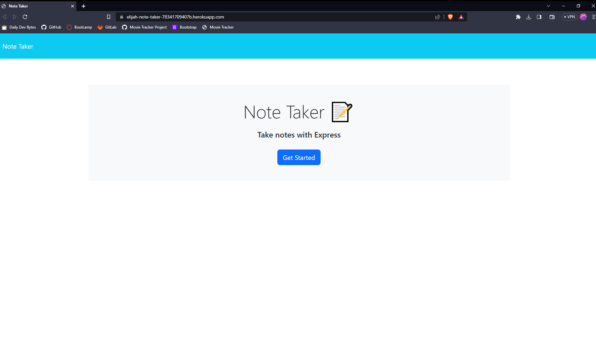

# Note Taker
  
  ## Table of Contents
  [Description](#description)
  [Installation](#installation)
  [Usage](#usage)
  [Questions](questions)
  [License](license)

  ## Description
  Note taking application
  https://elijah-note-taker-78341709407b.herokuapp.com/
  
  
  ## Installation
  Open link

  ## Usage
  Enter a title and note in the text boxes then click the save button in the top right. Click on a saved note's title on the left hand side to open the note, and click the red trashcan to delete the note.

  ## Questions
  https://github.com/ElijahAFrancis
  efrancis64@gmail.com

  ## License
    Licensed under the MIT license
    https://www.mit.edu/~amini/LICENSE.md
  